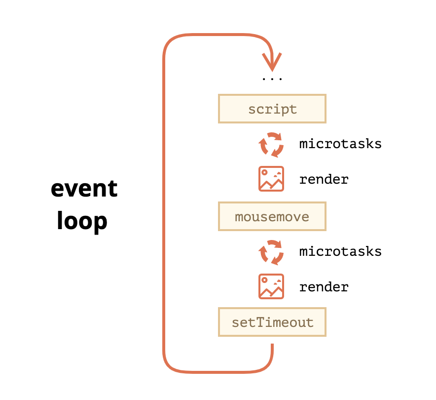

# Event loop and microtasks

## Event Loop

There’s an endless loop, where the JavaScript engine waits for tasks, executes them and then sleeps, waiting for more tasks.

The general algorithm of the engine:

While there are tasks:
execute them, starting with the oldest task.
Sleep until a task appears, then go to 1.

Microtasks come solely from our code. They are usually created by promises: an execution of .then/catch/finally handler becomes a microtask.
There’s also a special function queueMicrotask(func) that queues func for execution in the microtask queue.

A more detailed event loop algorithm (though still simplified compared to the specification):

1. Dequeue and run the oldest task from the macrotask queue (e.g. “script”).
2. Execute all microtasks: While the microtask queue is not empty: Dequeue and run the oldest microtask.
3. Render changes if any.
4. If the macrotask queue is empty, wait till a macrotask appears.
5. Go to step 1.

Further reading:

https://www.youtube.com/watch?v=8aGhZQkoFbQ&vl=en
https://www.youtube.com/watch?v=cCOL7MC4Pl0
https://javascript.info/event-loop
https://javascript.info/microtask-queue
https://developer.mozilla.org/en-US/docs/Web/API/HTML_DOM_API/Microtask_guide
